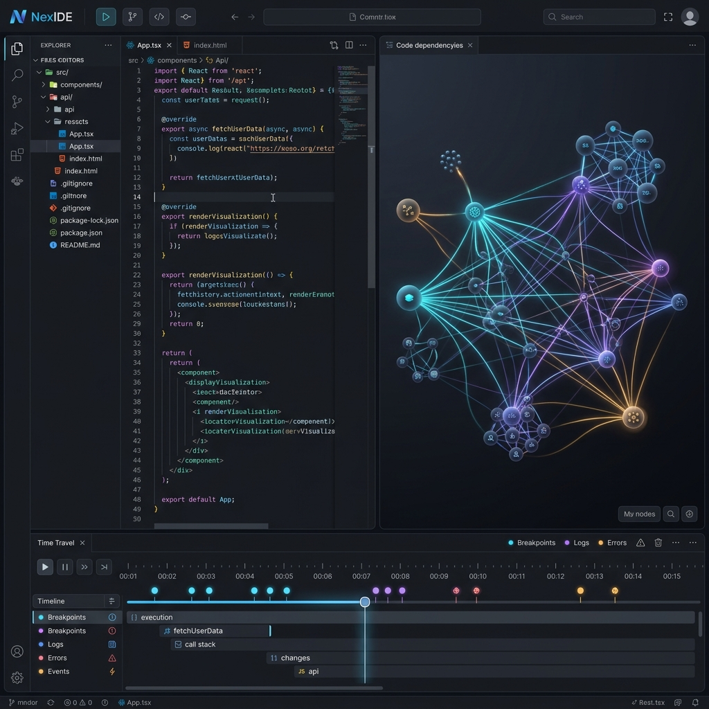
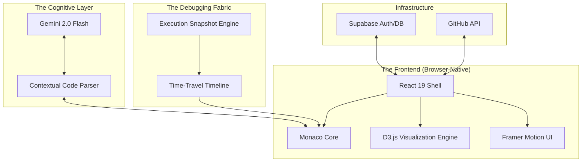
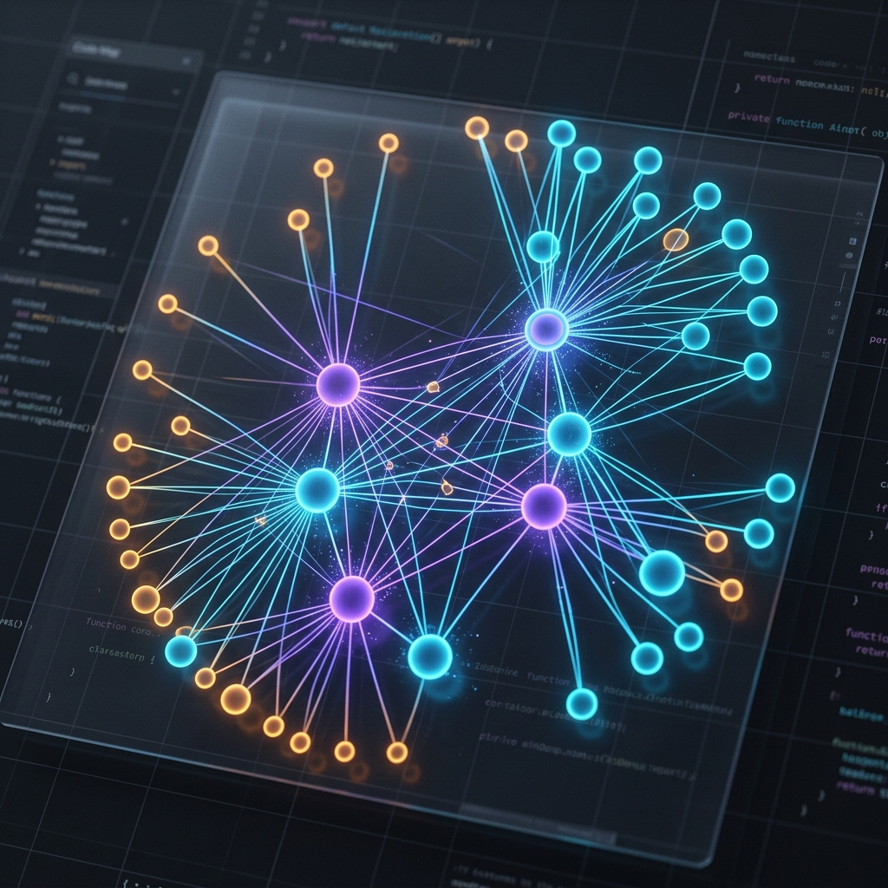

# 🌌 NexIDE: The Next-Gen Cognitive IDE



> [!NOTE]
> NexIDE isn't just an editor—it's a cognitive workspace that bridges the gap between raw code and mental models. Built for architects and visionaries, it combines local-first speed with a deep understanding of your codebase.

---

## 🧠 System Architecture

NexIDE leverages a sophisticated, decoupled architecture to provide an ultra-responsive, AI-augmented development experience.



---

## ⚙️ The Elite Tech Stack

Built on the bleeding edge of web technology:

| Layer | Technologies |
| :--- | :--- |
| **Core Framework** | React 19 (Concurrent Rendering), Vite 8 |
| **Code Editor** | Monaco-Editor (VS Code Engine) |
| **AI Integration** | Google Gemini 2.0 Flash (Streaming LLM) |
| **Visual Mapping** | D3.js (Force-Directed Graphs) |
| **Animations** | Framer Motion (Liquid interactions) |
| **Backend & Sync** | Supabase, GitHub API, JWT |

---

## 🎯 High-Impact Features

### 🧩 Real-Time Visual Code Mapping
Stop guessing file relationships. NexIDE automatically parses your AST and generates a dynamic, interactive map of your project's structure.
- **Architectural Clarity**: See how imports, functions, and classes relate instantly.
- **Dynamic Navigation**: Click any node to jump directly to the source.

### ⏳ Time-Travel Debugging
Step back in time to catch elusive bugs before they happen.
- **Execution Scrubber**: Record snapshots and playback code execution with a precision timeline.
- **Execution Waveform**: Visualize code execution density and frequency in real-time.

### ⚡ AI Pair Programmer
An integrated Gemini-powered assistant that "sees" what you see.
- **Contextual Intelligence**: AI understands your active code for ultra-fast debugging and refactoring.
- **Markdown Ready**: Seamless code generation directly into your workspace.

---

## 🔥 Unique Innovations

### 🛰️ **Cognitive Structural Visualization**
Unlike static file trees, NexIDE uses a D3-powered force-directed graph to visualize the *logic* of your code, not just the location. This creates a "neural map" of your application.



### 📈 **Execution Waveform Scrubber**
A unique UI component that builds a histogram of execution snapshots, letting you visually identify loops, high-frequency calls, and bottlenecks at a glance.

---

## 🌐 Live Demo & Deployment

[🚀 Launch NexIDE Live](https://nexide.vercel.app)
*(Local-first. Secure. Instant.)*

---

## 🛠️ Getting Started

1.  **Clone & Install**:
    ```bash
    git clone https://github.com/bansal1806/NexIDE.git
    cd NexIDE
    npm install
    ```
2.  **Environment Setup**:
    Add your API keys to `.env.local`:
    ```env
    VITE_GEMINI_API_KEY=your_key_here
    VITE_SUPABASE_URL=your_supabase_url
    ```
3.  **Run Development**:
    ```bash
    npm run dev
    ```

---

<p align="center">
  <sub>Built with precision by the NexIDE Team. © 2026</sub>
</p>
