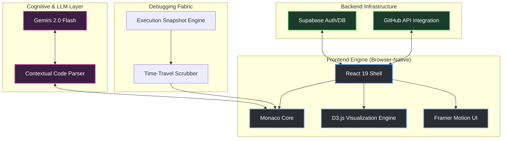
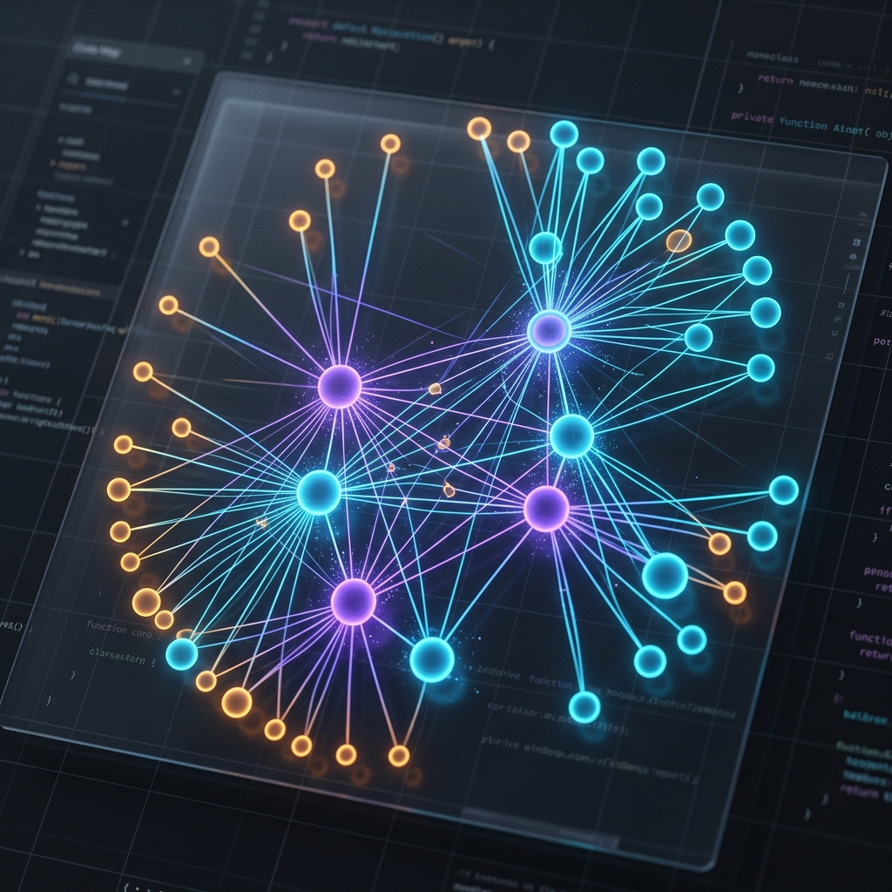

# 🌌 NexIDE: The Elite Cognitive Workspace

[](https://nex-ide.vercel.app/)
[](https://react.dev)
[](https://vitejs.dev)

> [!NOTE]  
> NexIDE isn't just an editor—it's a cognitive workspace that bridges the gap between raw code and mental models. Built for architects and visionaries, it combines local-first speed with a deep understanding of your codebase.

---

## 🚀 Project Overview

NexIDE is a next-generation web-based Integrated Development Environment (IDE) that goes beyond syntax highlighting. By integrating an advanced execution snapshot engine, an AI pair programmer, and real-time visualization of your project's logic, NexIDE transforms how developers interact with large codebases. It is built to be blisteringly fast, hyper-intelligent, and visually stunning.

---

## 🧠 Architecture Diagram

NexIDE leverages a sophisticated, decoupled architecture to provide an ultra-responsive, AI-augmented development experience.


```mermaid
graph TD
    subgraph "Frontend Engine (Browser-Native)"
        A[React 19 Shell] --> B[Monaco Core]
        A --> C[D3.js Visualization Engine]
        A --> D[Framer Motion UI]
    end

    subgraph "Cognitive & LLM Layer"
        E[Gemini 2.0 Flash] <--> F[Contextual Code Parser]
        F <--> B
    end

    subgraph "Backend Infrastructure"
        G[Supabase Auth/DB] <--> A
        H[GitHub API Integration] <--> A
    end

    subgraph "Debugging Fabric"
        I[Execution Snapshot Engine] --> J[Time-Travel Scrubber]
        J --> B
    end

    classDef core fill:#2A2D34,stroke:#4A90E2,stroke-width:2px,color:#FFF;
    classDef ai fill:#3C1E42,stroke:#B52F93,stroke-width:2px,color:#FFF;
    classDef backend fill:#1B3B2B,stroke:#34C759,stroke-width:2px,color:#FFF;
    
    class A,B,C,D core;
    class E,F ai;
    class G,H backend;
```

---

## ⚙️ Tech Stack

Built on the absolute bleeding edge of web technology:

| Layer | Technologies |
| :--- | :--- |
| **Core Framework** | **React 19** (Concurrent Rendering), **Vite 8** |
| **Code Editor** | **Monaco-Editor** (VS Code Engine powering the core) |
| **AI Integration** | **Google Gemini 2.0 Flash** (Streaming LLM) |
| **Visual Mapping** | **D3.js** (Force-Directed Graphs for AST mapping) |
| **Animations** | **Framer Motion** (Liquid, physics-based interactions) |
| **Backend & Sync** | **Supabase**, **GitHub API**, **JWT Authentication** |

---

## 🎯 Features

### 🧩 Real-Time Visual Code Mapping
Stop guessing file relationships. NexIDE automatically parses your AST and generates a dynamic, interactive map of your project's structure.
- **Architectural Clarity**: See how imports, functions, and classes relate instantly.
- **Dynamic Navigation**: Click any node to jump directly to the source.



### ⏳ Time-Travel Debugging
Step back in time to catch elusive bugs before they happen.
- **Execution Scrubber**: Record snapshots and playback code execution with a precision timeline.
- **Execution Waveform**: Visualize code execution density and frequency in real-time.

### ⚡ AI Pair Programmer
An integrated Gemini-powered assistant that "sees" what you see.
- **Contextual Intelligence**: AI understands your active code for ultra-fast debugging and refactoring.
- **Markdown Ready**: Seamless code generation directly into your workspace.

---

## 🔥 Unique Innovations

- 🛰️ **Cognitive Structural Visualization**: Unlike static file trees, NexIDE uses a D3-powered force-directed graph to visualize the *logic* of your code, not just the location. This creates a "neural map" of your application.
- 📈 **Execution Waveform Scrubber**: A unique UI component that builds a histogram of execution snapshots, letting you visually identify loops, high-frequency calls, and bottlenecks at a glance.
- 🛡️ **Local-First Security**: Emphasizes running the heavy lifting in-browser, ensuring code privacy and instant responsiveness without server latency.

---

## 🌐 Live Demo Link

Experience the future of coding right in your browser.

**👉 [Launch NexIDE Live (https://nex-ide.vercel.app/)](https://nex-ide.vercel.app/)**

---

## 🛠️ Getting Started

1.  **Clone & Install**:
    ```bash
    git clone https://github.com/bansal1806/NexIDE.git
    cd NexIDE
    npm install
    ```
2.  **Environment Setup**:
    Add your API keys to `.env`:
    ```env
    VITE_GEMINI_API_KEY=your_key_here
    VITE_SUPABASE_URL=your_supabase_url
    ```
3.  **Run Development**:
    ```bash
    npm run dev
    ```

---

<p align="center">
  <sub>Built with precision by the NexIDE Team. © 2026</sub>
</p>
